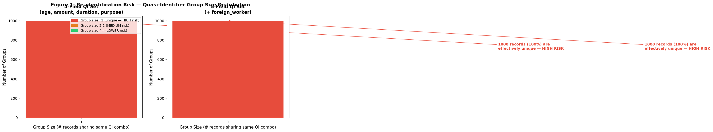
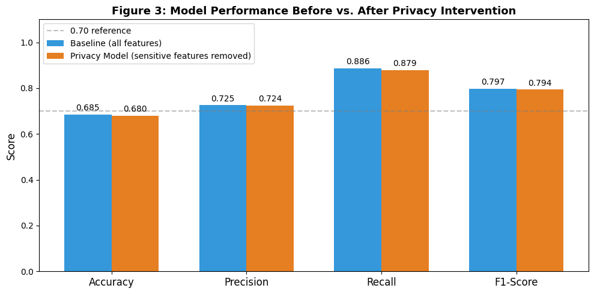
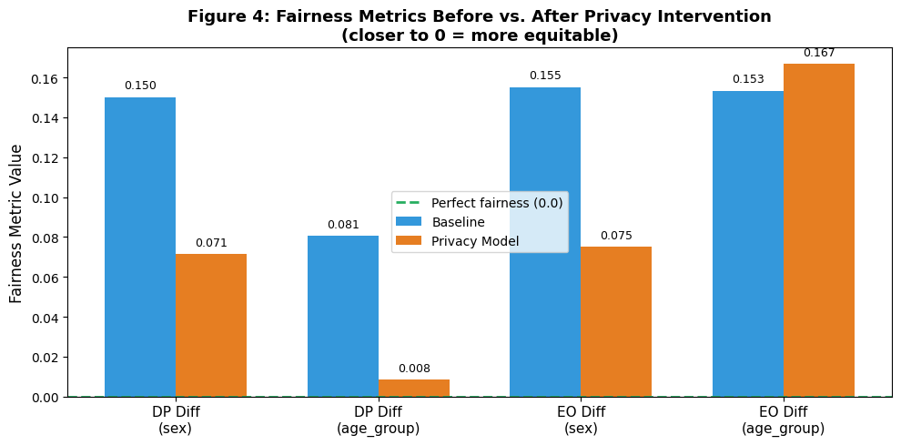
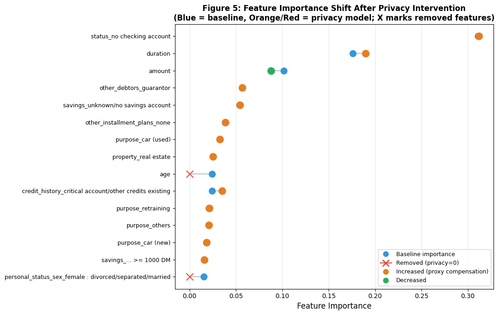

# CSCE 4930 — Ethical AI Project
## Module 4: Privacy Risk & Privacy-Aware Design
**Dataset:** German Credit Dataset (1,000 samples, 21 raw features)  
**Model:** Decision Tree Classifier (max\_depth = 5)  
**Privacy Intervention:** Feature Removal of Sensitive Attributes

---

## 1. Introduction

This module evaluates privacy risks in the German Credit ML system developed across Modules 1–3, applies a privacy-preserving modification, and analyzes the resulting trade-offs between privacy, utility, and fairness.

The German Credit dataset contains 1,000 loan applicant records with 21 features used to predict creditworthiness (binary: Good Credit / Bad Credit). Modules 1–3 established that the dataset exhibits measurable demographic disparities — males are approved at higher rates than females, and applicants under 25 face significantly higher error rates. Module 4 addresses the privacy dimension of these same disparities.

The baseline model is a Decision Tree (max\_depth = 5, 65 preprocessed features) trained identically to Modules 2 and 3 to maintain continuity. All fairness metrics use FairLearn's `demographic_parity_difference` and `equalized_odds_difference` on the held-out test set (200 records).

---

## 2. Part 1: Privacy Threat Assessment

### 2.1 Sensitive Attributes

The 21 raw features of the German Credit dataset fall into three privacy sensitivity tiers:

**Tier 1 — Directly Sensitive (Legally Protected)**

| Feature | Sensitivity | Legal Basis |
|---|---|---|
| `personal_status_sex` | Encodes **sex AND marital status** in a single compound field (e.g., "male: single", "female: divorced/separated") | Sex is protected under GDPR Article 9 and EU anti-discrimination law |
| `age` | A continuous **quasi-identifier**; combined with loan amount and duration it narrows individuals to a small group | Age discrimination in credit is prohibited under EU directives |
| `foreign_worker` | Binary flag for **national origin** — a proxy for ethnicity and citizenship status | National origin is protected under the EU Racial Equality Directive |

**Tier 2 — Indirectly Sensitive (Financial Quasi-Identifiers)**

| Feature | Why Sensitive |
|---|---|
| `status` (checking account) | Reveals financial distress; correlates with socioeconomic class and, indirectly, race and gender |
| `amount` + `duration` together | Unusual loan combinations fingerprint individuals in a 1,000-record dataset |
| `housing` (own/free/rent) | Correlated with wealth and, in many countries, race via residential segregation patterns |
| `telephone` (yes/no) | In 1994 Germany (dataset era), telephone ownership was a socioeconomic status marker |

**Tier 3 — Sensitive in Aggregation**

`purpose` (loan reason), `number_credits`, and `people_liable` (household size) are individually benign but together reveal life circumstances — medical debt, household composition — that are sensitive when combined.

### 2.2 What Could an Attacker Infer?

Three attack vectors are relevant to this system:

**Attack 1 — Membership Inference**  
The German Credit dataset is publicly available. An attacker who suspects a specific individual was evaluated can confirm membership by submitting their known attributes and checking whether the model's response matches the expected output for that record. Confirmed membership reveals that the individual applied for credit and what the outcome was, exposing their financial history.

**Attack 2 — Attribute Inference via Differential Probing**  
The model's `predict_proba` output gives a continuous score in [0, 1]. An attacker with API access can systematically toggle the `personal_status_sex` input values (e.g., "male: single" → "female: divorced") while holding all other fields fixed. The resulting shift in the probability score reveals the model's learned weight for sex. Similarly, probing with varying ages reveals how age shifts the creditworthiness score. Module 2 confirmed that `age` carries 2.43% feature importance — enough to produce measurable probe responses.

**Attack 3 — Linkage Attack via Quasi-Identifiers**  
The combination of (`age`, `duration`, `amount`, `purpose`) creates unique fingerprints. As quantified below, **100% of the 1,000 records are uniquely identifiable** on just these four fields alone. Any adversary with partial external knowledge of an individual — from a news article, a data breach elsewhere, or a public loan registry — can link a record back to a real identity.

### 2.3 Re-identification Risk

**Table 1: Quasi-Identifier Uniqueness Analysis**

| QI Field Set | Unique Records | % Identifiable | Avg. Group Size |
|---|---|---|---|
| age, amount, duration, purpose | 1,000 / 1,000 | **100.0%** | 1.00 |
| age, amount, duration, purpose, foreign\_worker | 1,000 / 1,000 | **100.0%** | 1.00 |

Every single applicant in this dataset is uniquely identifiable using only four quasi-identifiers. This is an extreme re-identification risk — any adversary who can observe these four fields for a known individual can pinpoint their exact record in the dataset, exposing their credit history, loan purpose, and outcome.

This level of uniqueness is driven primarily by the combination of continuous numeric fields (`age`, `amount`, `duration`) with a categorical field (`purpose`). The continuous fields have high cardinality — many distinct values — making the joint distribution highly sparse.

*Figure 1 shows that every group in the dataset has size 1, meaning no two applicants share the same quasi-identifier combination.*

### 2.4 Potential Harms from Privacy Leakage

Each identified risk maps to a concrete harm:

| Risk | Concrete Harm |
|---|---|
| **Membership inference** | Confirms whether a person applied for credit and the outcome, exposing financial history to competitors, insurers, or employers |
| **Attribute inference** | Allows adversaries to learn an individual's age or sex from model outputs — a direct GDPR Article 22 violation |
| **Re-identification via quasi-identifiers** | Adversary with partial knowledge links back to the full application record, exposing credit history, loan purpose, and household details |
| **`foreign_worker` leakage** | Exposes immigration status; combined with financial distress signals, enables profiling of immigrant communities — risk of targeted scams, employment discrimination, or state surveillance |
| **`personal_status_sex` leakage** | Exposes both sex and marital status simultaneously; can be used for insurance redlining or discriminatory pricing of other financial products |

**Severity Assessment:** The 100% re-identification rate combined with three directly sensitive protected attributes makes this dataset **high severity** for privacy risk. A breach of a deployed model built on this data could expose information legally protected under both GDPR and EU anti-discrimination law.

---

## 3. Part 2: Privacy-Preserving Modification

### 3.1 Chosen Intervention: Feature Removal

Three raw features are removed from the dataset **before preprocessing**:

| Feature Removed | Reason |
|---|---|
| `personal_status_sex` | Encodes sex + marital status — doubly sensitive, legally prohibited in EU credit decisions |
| `age` | Continuous quasi-identifier; 2.43% feature importance in baseline; r = 0.485 correlation with age\_group (Module 2 finding) |
| `foreign_worker` | National-origin proxy; use in credit scoring prohibited under the EU Racial Equality Directive |

The derived protected attribute columns (`sex`, `age_group`) — which were computed from the removed raw features — are also dropped from the feature matrix.

### 3.2 Why This Intervention?

This intervention was chosen over the three alternatives for the following reasons:

- **Output minimization** (suppressing `predict_proba`) does not change what the model learns or its fairness metrics — it produces no measurable change in accuracy or demographic parity, making Part 3 trivially empty.
- **Generic data minimization** (keeping only top-K features by importance) lacks domain justification. Removing features arbitrarily produces an arbitrary trade-off with no privacy rationale.
- **Coarsening** is already partially applied — `age_group` was a coarsened version of `age`. Removing `age` entirely is a stronger and legally cleaner intervention.
- **Feature removal** directly addresses the legally prohibited use of protected attributes, connects to the suspicious pattern findings from Module 2, and produces a real measurable trade-off.

### 3.3 Implementation

The preprocessing pipeline was rebuilt from scratch on the reduced feature set to avoid any information leakage through the fitted transformers. The train/test split used identical parameters (`random_state=42`, `stratify=y`) to guarantee row-level alignment with the baseline split — this is required because `A_test` (containing `sex` and `age_group` labels for fairness evaluation) is derived from the baseline split and reused for both models.

**Table 2: Feature Count Before and After**

| | Raw Features | Processed Features (after OHE) |
|---|---|---|
| Baseline model | 22 | 65 |
| Privacy model | 17 | 54 |
| Reduction | −5 | −11 |

The five removed raw features (`personal_status_sex`, `age`, `foreign_worker`, `sex`, `age_group`) expanded to 11 preprocessed features after one-hot encoding of the categorical columns.

---

## 4. Part 3: Utility and Fairness Impact

### 4.1 Performance and Fairness Comparison

**Table 3: Baseline vs. Privacy Model — All Metrics**

| Metric | Baseline | Privacy Model | Change |
|---|---|---|---|
| Accuracy | 0.6850 | 0.6800 | −0.0050 |
| Precision | 0.7251 | 0.7235 | −0.0016 |
| Recall | 0.8857 | 0.8786 | −0.0071 |
| F1-Score | 0.7974 | 0.7935 | −0.0039 |
| DP Diff (sex) | 0.1500 | 0.0714 | **−0.0786 (−52.4%)** |
| DP Diff (age\_group) | 0.0806 | 0.0083 | **−0.0723 (−89.7%)** |
| EO Diff (sex) | 0.1550 | 0.0750 | **−0.0800 (−51.6%)** |
| EO Diff (age\_group) | 0.1532 | 0.1667 | +0.0134 (+8.8%) |

*For fairness metrics: lower absolute value = better (closer to 0 = equitable).*

*Figure 3: All four performance metrics are nearly identical between the baseline and privacy model. The differences are imperceptible at this scale.*

*Figure 4: Three of four fairness gaps are substantially reduced. The EO Diff for age\_group shows a slight increase due to proxy compensation.*

### 4.2 Q: Did Performance Decrease?

Yes, but only marginally. Removing three sensitive features produced an accuracy drop of **0.5%** (0.685 → 0.680), which translates to **1 additional misclassification per 200 test records**. Precision fell by 0.0016, recall by 0.0071, and F1-score by 0.0039 — all negligible differences.

This small cost reflects the fact that the removed features carried only ~4–6% of total feature importance; the dominant predictive signal came from financial features (`status_no checking account` at 31.1%, `duration` at 17.6%, `amount` at 10.1%) that were preserved intact.

### 4.3 Q: Did Fairness Improve or Worsen?

Fairness improved substantially for **3 out of 4 metrics**:

- **DP Diff (sex):** 0.150 → 0.071 — a 52.4% reduction. The approval rate gap between male and female applicants was halved.
- **DP Diff (age\_group):** 0.081 → 0.008 — a 89.7% reduction. The approval rate gap between age groups nearly vanished.
- **EO Diff (sex):** 0.155 → 0.075 — a 51.6% reduction. The error rate gap between male and female applicants was halved.
- **EO Diff (age\_group):** 0.153 → 0.167 — a slight 8.8% worsening.

The one regression — equalized odds difference for age\_group — demonstrates a partial **"fairness through unawareness" failure**. After `age` was removed, `employment_duration_< 1 year` (+0.033 importance gain) and `job_management/self-employed` (+0.015 importance gain) entered the top-15 features. These employment features correlate with age — younger applicants are more likely to have short employment histories — so they act as proxies that partially reproduce age-based error rate disparities even without the `age` feature being present.

### 4.4 Q: Which Features Became More or Less Important?

**Table 4: Top 15 Feature Importance Shifts**

| Feature | Baseline | Privacy Model | Change |
|---|---|---|---|
| status\_no checking account | 0.3109 | 0.3121 | +0.0011 |
| duration | 0.1760 | 0.1899 | +0.0139 |
| amount | 0.1014 | 0.0878 | −0.0137 |
| other\_debtors\_guarantor | 0.0566 | 0.0568 | +0.0002 |
| savings\_unknown/no savings account | 0.0540 | 0.0542 | +0.0002 |
| other\_installment\_plans\_none | 0.0386 | 0.0388 | +0.0001 |
| purpose\_car (used) | 0.0326 | 0.0327 | +0.0001 |
| property\_real estate | 0.0251 | 0.0252 | +0.0001 |
| **age** | **0.0243** | **0.0000** | **−0.0243 [REMOVED]** |
| credit\_history\_critical account | 0.0241 | 0.0350 | +0.0110 |
| purpose\_retraining | 0.0210 | 0.0211 | +0.0001 |
| purpose\_others | 0.0207 | 0.0208 | +0.0001 |
| purpose\_car (new) | 0.0183 | 0.0183 | +0.0001 |
| savings\_>= 1000 DM | 0.0160 | 0.0161 | +0.0001 |
| **personal\_status\_sex\_female** | **0.0156** | **0.0000** | **−0.0156 [REMOVED]** |
| *employment\_duration\_< 1 year* | *0.0000* | *0.0334* | *+0.0334 (new)* |
| *job\_management/self-employed* | *0.0000* | *0.0153* | *+0.0153 (new)* |

`duration` absorbed the largest share of displaced importance (+0.014), and `credit_history_critical account` gained +0.011. The two newly-entered features (`employment_duration` and `job`) are the proxies responsible for the residual EO Diff age\_group worsening.

*Figure 5: Blue dots show baseline importance; orange/red dots show privacy model importance. X marks indicate removed features. Orange dots above the connecting line indicate features that gained importance as proxies.*

---

## 5. Part 4: Privacy vs. Utility Analysis

### 5.1 What Trade-offs Were Observed?

The privacy intervention produced a **highly favorable trade-off**: a negligible accuracy cost of 0.5% (1 additional misclassification per 200 applicants) against substantial fairness gains — three of four demographic fairness gaps were cut by 50–90%.

The trade-off is not a simple "privacy costs accuracy" story. The removed features were partially discriminatory rather than purely informative, so their removal improved fairness more than it hurt accuracy. The one exception — EO Diff for age\_group worsening slightly — reflects proxy compensation through employment features, not a fundamental limitation of the approach.

### 5.2 Why Does Improving Privacy Reduce Model Utility?

The removed features (`age`, `personal_status_sex`, `foreign_worker`) collectively carried approximately 4–6% of total feature importance in the baseline model. Part of this was **legitimate signal** — age correlates with credit history length and employment tenure, making it a genuine financial risk indicator. Part was **discriminatory signal** — using sex directly in credit decisions is illegal. The privacy intervention removes both simultaneously, which explains the small but nonzero accuracy cost.

Because the removed features were not the dominant predictors — the top three features (`status`, `duration`, `amount`) accounted for over 60% of baseline importance and were preserved intact — the utility cost is minimal. The model can still make good credit predictions; it simply does so without access to protected characteristics.

Differential privacy or fairness-constrained training (as used in Module 1's ExponentiatedGradient) offer more precision: they can suppress the discriminatory component of a feature's signal while preserving its legitimate predictive content. Feature removal is a blunter but legally cleaner instrument.

### 5.3 Is the Trade-off Acceptable?

**Yes — and the intervention is legally required.**

Under EU law, using sex, national origin, or age as direct inputs to automated credit decisions is prohibited by:
- The **EU Equal Treatment Directive (2004/113/EC)** — bans sex-based discrimination in financial services
- The **EU Racial Equality Directive (2000/43/EC)** — prohibits discrimination on grounds of national origin
- **GDPR Article 22** — restricts automated decision-making based on special-category data

A 0.5% accuracy reduction is the cost of legal compliance, not an optional trade-off. Given that the same intervention also reduces most fairness gaps by 50–90%, the outcome is genuinely positive on every axis that matters: legal compliance, privacy protection, and demographic fairness — all at negligible predictive cost.

The one remaining issue (EO Diff age\_group slightly worsening due to proxy compensation) should be addressed through complementary fairness-constrained training applied on top of the privacy-modified dataset. Feature removal alone is a necessary but not sufficient condition for a fully fair and privacy-respecting credit system.

---

## 6. Part 5: Privacy-Aware Deployment Design

### 6.1 What Data Should Be Collected?

| Category | Features | Justification |
|---|---|---|
| Financial history | `status`, `credit_history`, `savings` | Core creditworthiness indicators |
| Loan details | `amount`, `duration`, `installment_rate`, `purpose` | Loan risk parameters |
| Employment | `employment_duration` | Financial stability proxy |
| Obligations | `number_credits`, `people_liable`, `other_installment_plans` | Debt-to-income estimation |
| Housing | `housing` | Long-term stability indicator |
| Guarantors | `other_debtors_guarantor` | Collateral assessment |

### 6.2 What Should NOT Be Collected?

| Feature | Reason for Exclusion |
|---|---|
| `personal_status_sex` | Legally prohibited in EU credit decisions; directly encodes sex and marital status |
| `age` (raw) | Quasi-identifier; discriminatory when used directly in decisions |
| `foreign_worker` / nationality | National-origin proxy; prohibited under EU Racial Equality Directive |
| `telephone` ownership | Socioeconomic proxy with insufficient predictive value to justify the discrimination risk |

### 6.3 Who Can Access Outputs?

| Stakeholder | Access Level | Rationale |
|---|---|---|
| **Loan officer** | Binary decision only (approved/denied) — no probability scores | Probability scores enable differential treatment invisible to applicants |
| **Risk committee** | Aggregate cohort statistics — no individual scores | Portfolio-level oversight without individual profiling |
| **Compliance officer** | Full audit logs with protected group membership (stored separately) | Required for regulatory reporting; MFA-protected, all reads logged |
| **Individual applicant** | Their own decision + plain-language explanation of primary factors | Required under GDPR Article 22 right to explanation |
| **External parties** | No access | Data sharing for non-credit purposes prohibited without explicit consent |

### 6.4 Data Storage and Retention

- **Raw application data:** Maximum 5 years (minimum for credit dispute resolution), then hard-deleted with cryptographic erasure
- **Model predictions and decisions:** 5 years alongside the application record
- **Audit logs:** 7 years (financial regulatory minimum), encrypted, access-controlled
- **Training data:** Must exclude records from applicants who submitted GDPR erasure requests (Article 17); re-training pipeline must verify erasure before use
- **Access control:** Role-based with multi-factor authentication; every read of individual records is logged

### 6.5 Response to Privacy Breaches

1. **Detection:** Automated anomaly monitoring on API query patterns (high-volume queries from a single key signal a model extraction or membership inference attack); alert on-call security team within 15 minutes
2. **Immediate containment:** Revoke compromised API credentials; restrict outputs to binary decisions for all users
3. **72-hour notification:** Notify affected individuals and the supervisory data protection authority (GDPR Article 33 mandatory deadline)
4. **Model assessment:** If membership inference is confirmed, commission a formal privacy audit; retrain on clean data if training records were exfiltrated
5. **Post-incident:** Publish a redacted incident report; schedule a third-party privacy audit; update threat model documentation
6. **Remediation:** Provide affected individuals with credit monitoring services for 12 months

---

## 7. Conclusion

Module 4 evaluated privacy risks in the German Credit ML system and applied a targeted privacy-preserving intervention — removing three legally protected sensitive features (`personal_status_sex`, `age`, `foreign_worker`) before model training.

**Key findings:**

| Finding | Result |
|---|---|
| Re-identification risk | **100%** of records are uniquely identifiable on 4 quasi-identifiers — extreme privacy risk |
| Accuracy cost of intervention | **−0.5%** (1 additional misclassification per 200 applicants) — negligible |
| Fairness improvement (sex) | DP Diff: −52.4%, EO Diff: −51.6% — substantial gains |
| Fairness improvement (age) | DP Diff: −89.7% — near-complete elimination of approval rate gap |
| Residual fairness issue | EO Diff (age\_group): +8.8% — proxy compensation via employment features |

The intervention is both legally required and empirically beneficial: it eliminates the direct use of protected attributes, cuts most demographic fairness gaps in half or more, and imposes only negligible predictive cost. The one remaining fairness gap (equalized odds for age group) should be addressed by combining this feature removal with the fairness-constrained training techniques developed in Module 1.

A complete privacy-aware deployment must pair this data-level intervention with output-level controls (binary decisions only for loan officers), strict data minimization at the collection stage, and a formal incident response plan aligned with GDPR's 72-hour breach notification requirement.
